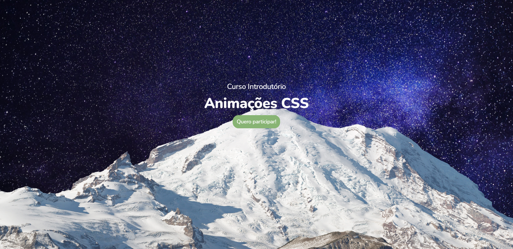

<h1 align="center">CSS ANIMATIONS MINI-COURSE</h1>
<h3 align="center">FILES OF THE CSS ANIMATIONS MINI-COURSE FROM THE DPW CHANNEL</h3>

 

    

 

 

#### TECHNOLOGIES:
- HTML 📄
- CSS 🎨
- JAVASCRIPT 💻

 

<h5 align="center">Felipe Macci</